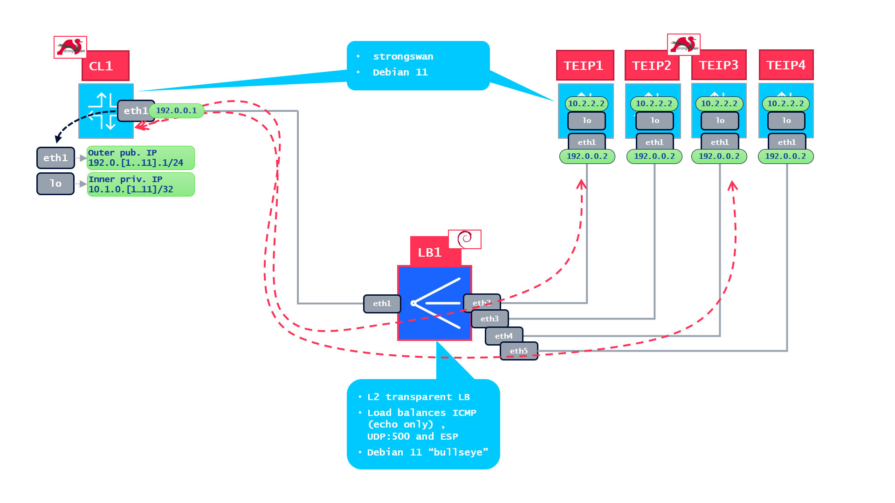
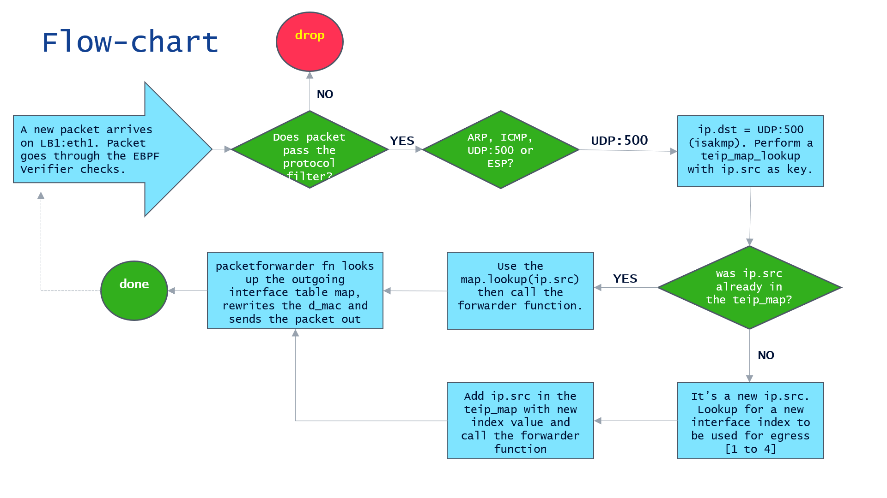

# xdipisec

## intro

xdipisec is an IPsec tunnel load balancer based on [eBPF XDP](https://docs.cilium.io/en/latest/bpf/progtypes/#xdp) framework.
you can maybe remember the (in)famous python-based tool [scapysec](https://github.com/federic000/scapysec) which has the same purpose.
What benefits XDP brings, is it simply _"fitter, happier, more productive"_ as a Radiohead song says?
let's find out.

## how it works and what it does

starting from a picture as usual  :



IPSec tunnels are started by the **CL1** node, it is configured to bring up 10 tunnels with a destination IP `192.0.0.2`.
**LB1** takes incoming traffic from its `eth1` interface where xdp program is attached. LB1 performs some actions (See later user/kernel space sections)
to check if the packet is conformant, in that case it tracks the source IP and sends packets out of one of the egress interfaces `[eth2....eth5]` in this example.
subsequent packets (ICMP, ESP) are sent out to the same interface to keep the session tracked. this is possible
thanks to the magic of eBPF maps. As a result, these 10 tunnels are fairly distributed across the **TEIP1...4** nodes.

the whole thing runs on (guess what?) [containerlab ](https://containerlab.dev/). Container image is also
available for pulling from [docker hub](https://hub.docker.com/r/federic0/icsdipisec-deb11).

## containerlab setup

important things to consider from the topology definition file, *binds* and *exec* entries.
the *binds* for all the nodes (except **LB1**) are required to have the container reading files in the directory
where configuration scripts are located :


      kind: linux
      image: debian:swan2
      binds:
        - ~/xdipisec/:/home
      exec:
        - bash /home/shscripts/startup_cl.sh

at startup, **CL1** executes it's own shell script which provides for interface addressing and strongswan configuation.

**LB1** is slightly different:

     kind: linux
     image: debian:swan2
     binds:
      - ~/xdipisec/:/home
      - /lib/modules/:/lib/modules
      - /usr/include/:/usr/include
      - /usr/src/:/usr/src
      - /sys/kernel/:/sys/kernel

There are no startup scripts (**LB1** has no IP configuration to deal with) to compile and run eBPF/XDP code it requires access to standard Linux kernel libraries, headers and modules on the host.
Access to `/sys/kernel/debug/tracing/...` files is not mandatory but necessary for troubleshooting purposes.

The underlying host runs the same Debian 11 "bullseye" distribution. Kernel sources, headers and modules are required.


The container image embeds all that is required to run [BCC](https://github.com/iovisor/bcc), the eBPF compiler collection, scapy, python3, iproute2, a proper ping tool,
strongswan, netcat, tcpdump and other various useful tool not normally included in the official Debian container image.


## kernel space code overview: ics_lb_v1.c
A flow-chart explains what's going on in kernel space:



this piece of code constitutes the core of **LB1** capability. it is made with some functions and declarations:

#### the maps

 ```
 // interface index map used to redirect packets out
BPF_DEVMAP(intfmap, 8);

// hash map to keep track of source IP and their destination
struct src_ip {
     __be32 ipAddr;
};
BPF_HASH(teip_map, struct src_ip, int, 256);

// array counter used to distribute new tunnels across available interfaces
BPF_ARRAY(rr_count, int, 1);

// array counter to keep track of processed packets
BPF_PERCPU_ARRAY(pktcnt, long, 1);
```

maps are defined in order to keep track of events, interfaces, IP sources, and as usual to allow
interaction between kernel and user space.

1. [BPF_DEVMAP](https://github.com/iovisor/bcc/blob/master/docs/reference_guide.md#11-bpf_devmap) is compiled at startup from the user space script _ics_lb_v1.py_. It has 8 entries where 8 interface indexes can be stored.
it can be modified to allow for more interfaces of course. in this project we do use 5 interfaces, 1 for ingress and 4 for egress.
2. [BPF_HASH(teip_map,...)](https://github.com/iovisor/bcc/blob/master/docs/reference_guide.md#2-bpf_hash) is a hash map as the name implies, it is used to keep track
of source IP's and their respective interface index (IP.src = key, intf_index = value)
3. [BPF_ARRAY(rr_count,...)](https://github.com/iovisor/bcc/blob/master/docs/reference_guide.md#3-bpf_array) uses integer values to Round Robin across interface indexes.
every new IP that comes in, gets a new index as `index = index + 1`.
4. [BPF_PERCPU_ARRAY(pktcnt,...)](https://github.com/iovisor/bcc/blob/master/docs/reference_guide.md#8-bpf_percpu_array) map
is used to simply count how many packets are forwarded, also shows how packets are distributed across available CPUs.

#### the functions

1. *int packetforwarder* function is called every time a packets needs to be sent out on an interface. it also performs an important task, to push ethernet d_mac on the packet.
the d_mac is pushed on the basis of adjacent **TEIP** node that has been selected as destination.
2. *int xdp_redirect_ingr(struct xdp_md *ctx)* is the core function of xdipisec. Here we inspect packets to fulfill eBPF verifier before anything else.
Then, based on the incoming packet protocol we startup other actions.
  - if it's `ARP`, we send it out always on `eth2`. It does not matter too much, the startup scripts are taking care of ARP resolution. On egress or ingress, it does not even matter to check received source or destination MAC addresses
  on frames since we are going to change those for every packet, invalidating standard Ethernet resolution rules.
  - if it's `ICMP`, or `UDP:500`, if `teip_map.lookup` returns a value (acts as an interface index) packet is sent out by means of `packetforwarder` function. Otherwise a new entry is added on the `teip_map` and associated with an exit interface,
  eventually this new packet is handed over `packetforwarder`.
  - If packet is `ESP`, it's assumed IKEv2 on `UDP:500` already kicked in and filled a dedicated `teip_map` entry.
  - anything else is dropped by `XDP_DROP` action.
  - this function is applied to `eth1` only
3. *int xdp_redirect_egr* is the function that takes care of packets from **TEIP** nodes back to **CL1**. Filtering, map lookups have been done already and there's only one interface

where to send packets. this function is applied to `eth2...eth5`. Does not even rely on the `packetforwarder` function because always sends packet out of `eth1`.

## user space code overview : ics_lb_v1.py

the user space python script performs some tasks which are essential for **LB1** to handle and spread packets across interfaces,
as well as acting as the presentation and setup layer.
1. loads and compile the program `BPF(src_file="ics_lb_v1.c", cflags=["-w"])`
2. populates interface index map by calling `devmap = b["intfmap"]`
3. `b.attach_xdp` lines are required to attach a specific function to a specific interface. There's an important option here, the `flags=BPF.XDP_FLAGS_SKB_MODE`
instructs the network driver to handle the packet following the specified eBPF function. in a simulation like this, packets are directly
handed over to kernel. You can change this flag DRV_MODE or HW_MODE when driver or NIC respectively are able to process XDP code directly, without kernel interaction.
these two last modes are of course giving maximum benefits in terms of performances.
4. presents total packets and packets per second statistics.
5. `CTRL-C` stops the script from running
6. `unload_xdp.sh` removes `xdpgeneric` program from all interfaces.


## spin it up!

as soon as the `clab deploy` is completed you should see this:
```
+---+--------------------+--------------+--------------+-------+---------+----------------+----------------------+
| # |        Name        | Container ID |    Image     | Kind  |  State  |  IPv4 Address  |     IPv6 Address     |
+---+--------------------+--------------+--------------+-------+---------+----------------+----------------------+
| 1 | clab-icsdp01-CL1   | ecd53e0ce146 | debian:swan2 | linux | running | 172.20.20.5/24 | 2001:172:20:20::5/64 |
| 2 | clab-icsdp01-LB1   | 0e71da5412a3 | debian:swan2 | linux | running | 172.20.20.7/24 | 2001:172:20:20::7/64 |
| 3 | clab-icsdp01-TEIP1 | 06a0dcfbcb01 | debian:swan2 | linux | running | 172.20.20.2/24 | 2001:172:20:20::2/64 |
| 4 | clab-icsdp01-TEIP2 | 3152e84dcf34 | debian:swan2 | linux | running | 172.20.20.3/24 | 2001:172:20:20::3/64 |
| 5 | clab-icsdp01-TEIP3 | 2c61cb217577 | debian:swan2 | linux | running | 172.20.20.4/24 | 2001:172:20:20::4/64 |
| 6 | clab-icsdp01-TEIP4 | 9b29934b3116 | debian:swan2 | linux | running | 172.20.20.6/24 | 2001:172:20:20::6/64 |
+---+--------------------+--------------+--------------+-------+---------+----------------+----------------------+
```

login into the nodes as usual, `docker exec -it clac-icsdp01-LB1 bash` and then execute the python script as

```
user@LB1:/home# ./ics_lb_v1.py eth1 eth2 eth3 eth4 eth5
populating interface index map...
interface indexing done...

now attaching xdp to interfaces...

something is going on..... hit CTRL+C to stop
# long(1699) total pkts - 2 pkts-per-sec @ 2023-08-02 08:36:44.6759299

[counters are shown only after traffic starts coming in]
```

now start bringing up tunnels from **CL1**, at least 4 or more tunnels which are named `tun01...tun10`

```
user@CL1:/# ipsec up tun06
.
.
CHILD_SA tun06{2} established with SPIs c15f8290_i caf56149_o and TS 10.1.0.6/32 === 10.2.2.2/32
received AUTH_LIFETIME of 28062s, scheduling reauthentication in 27522s
connection 'tun06' established successfully
```

if you take a look to **TEIP** nodes you should see a fair distribution of tunnels:


```
user@debian11:~# docker exec -it clab-icsdp01-TEIP1 ipsec status
Security Associations (3 up, 0 connecting):
vpn-concentrator[17]: ESTABLISHED 3 minutes ago, 192.0.0.2[192.0.0.2]...192.0.9.1[192.0.9.1]
vpn-concentrator{17}:  INSTALLED, TUNNEL, reqid 3, ESP SPIs: cb3ffdea_i c6a4c83e_o
vpn-concentrator{17}:   10.2.2.2/32 === 10.1.0.9/32
vpn-concentrator[16]: ESTABLISHED 4 minutes ago, 192.0.0.2[192.0.0.2]...192.0.5.1[192.0.5.1]
vpn-concentrator{16}:  INSTALLED, TUNNEL, reqid 1, ESP SPIs: c8e58f5c_i c20429aa_o
vpn-concentrator{16}:   10.2.2.2/32 === 10.1.0.5/32
vpn-concentrator[15]: ESTABLISHED 4 minutes ago, 192.0.0.2[192.0.0.2]...192.0.1.1[192.0.1.1]
vpn-concentrator{15}:  INSTALLED, TUNNEL, reqid 2, ESP SPIs: c64d8164_i c6b1b561_o
vpn-concentrator{15}:   10.2.2.2/32 === 10.1.0.1/32

user@debian11:~# docker exec -it clab-icsdp01-TEIP2 ipsec status
Security Associations (3 up, 0 connecting):
vpn-concentrator[17]: ESTABLISHED 3 minutes ago, 192.0.0.2[192.0.0.2]...192.0.10.1[192.0.10.1]
vpn-concentrator{17}:  INSTALLED, TUNNEL, reqid 3, ESP SPIs: c62e32b2_i c805a3e2_o
vpn-concentrator{17}:   10.2.2.2/32 === 10.1.0.10/32
vpn-concentrator[16]: ESTABLISHED 4 minutes ago, 192.0.0.2[192.0.0.2]...192.0.6.1[192.0.6.1]
vpn-concentrator{16}:  INSTALLED, TUNNEL, reqid 1, ESP SPIs: c34b0ea8_i c522f6b6_o
vpn-concentrator{16}:   10.2.2.2/32 === 10.1.0.6/32
vpn-concentrator[15]: ESTABLISHED 4 minutes ago, 192.0.0.2[192.0.0.2]...192.0.2.1[192.0.2.1]
vpn-concentrator{15}:  INSTALLED, TUNNEL, reqid 2, ESP SPIs: cf3235c9_i c0aa031f_o
vpn-concentrator{15}:   10.2.2.2/32 === 10.1.0.2/32

[more or less the same for TEIP3 and TEIP4]
```

pinging the remote inner address also is done on a per interface basis using `lo` addresses

```
user@CL1:/# ping -i 0.1 10.2.2.2 -I 10.1.0.6
PING 10.2.2.2 (10.2.2.2) from 10.1.0.6 : 56(84) bytes of data.
64 bytes from 10.2.2.2: icmp_seq=1 ttl=64 time=0.311 ms
64 bytes from 10.2.2.2: icmp_seq=2 ttl=64 time=0.060 ms
64 bytes from 10.2.2.2: icmp_seq=3 ttl=64 time=0.062 ms
.
.

```

you can also take a look at BPF maps, as the ```teip_map```
which shows association between the source IP (in decimal representation) and interface index:

```
user@debian11:~# docker exec -it clab-icsdp01-LB1 bpftool map dump id 303
[{
        "key": {
            "ipAddr": 16908480
        },
        "value": 2
    },{
        "key": {
            "ipAddr": 17498304
        },
        "value": 3
    },{
.
.
.
```


## conclusion

hope you also enjoyed this journey along kernel packet handling given by eBPF/XDP, the fact you can push packet attributes at L2, L3 and L4 on a byte-by-byte basis
gives you the super-powers of packet manipulation! ;-)

## references
1. start from here https://www.tigera.io/learn/guides/ebpf/ebpf-xdp/
2. another pretty good intro https://www.datadoghq.com/blog/xdp-intro/
2. the most complete tutorial, if you are successful compiling it https://github.com/xdp-project/xdp-tutorial
3. the most essential tool https://github.com/iovisor/bcc
3. running eBPF on containers can be sometimes complicated because of dependencies, compilers, headers etc etc, a nice guide is provided here https://andreybleme.com/2022-05-22/running-ebpf-programs-on-docker-containers/
